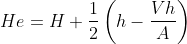
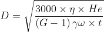
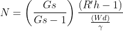

### INTRODUCTION

###  Stoke's Law :

Stoke's law states that the force that retards a sphere moving through a viscous fluid is directly proportional to the velocity and the radius of the sphere, and the viscosity of the fluid.

  
F = 6&pi;rv

Where,  
F	= Viscous drag force,  
&eta;	= Coefficient of viscosity,  
r	= Radius of the sphere,  
v	= Velocity of the object.

### Hydrometer :

Hydrometer is an instrument used to determine the density or relative density of different fluids based on the concept of buoyancy.  
A hydrometer usually consists of a sealed hollow glass tube with a wider bottom portion for buoyancy, a ballast (inside liquid) such as lead or mercury for stability, and a narrow stem with graduations. The liquid to test is poured into a graduated cylinder, and the hydrometer is  lowered into the liquid until the hydrometer floats freely. The point at which the surface of the liquid touches the stem of the hydrometer correlates to relative density.   

### Hydrometer Analysis :

The hydrometer method of sedimentation analysis is used to determine the distribution of soil whose particle size is less than 75 micron. This test is based on stoke's law. The reading on the stem of the hydrometer gives density of the suspension at the center of the hydrometer bulb. The effective depth (He) corresponding to each of the major calibration marks is given by the following expression.  

 

Where,  
He = Effective depth corresponding to each reading, 
H   = Distance between neck and bottom of bulb, 
h   = Distance between hydrometer reading and neck, 
Vh = Volume of hydrometer, 
A  = Cross sectional area of measuring jar.

This equation is used for drawing the calibration curve of He vs Rh where Rh is the hydrometer reading.  
A graph of particle size vs percentage finer has to be drawn on a semi log graph sheet to obtain the grain distribution curve.  

##### The particle size can be derived by the following expression :  
 

 

Where,   
G	 = Grain specific gravity.  
&eta;= viscosity of water.  
&gamma;w= unit weight of water.   
t	 = Time in minutes.  
He	 = Depth in cm.  
 

##### Percentage finer can be derived by the following formula :  
 

 

Where,   
R'h	= Corrected hydrometer reading.  
Gs	= Grain specific gravity.
  

#### Importance of hydrometer analysis :   

<ul>
<li> Hydrometer analysis is crucial to find the particle size distribution of fine grained soils.  </li>
<li>The particle size distribution data obtained from the sieve analysis can be combined together with the hydrometer analysis to get a complete particle size distribution curve.  </li>
<li>This analysis will also be helpful in determining the percentage of silt and clay particles present in the soil sample.</li>
</ul>
