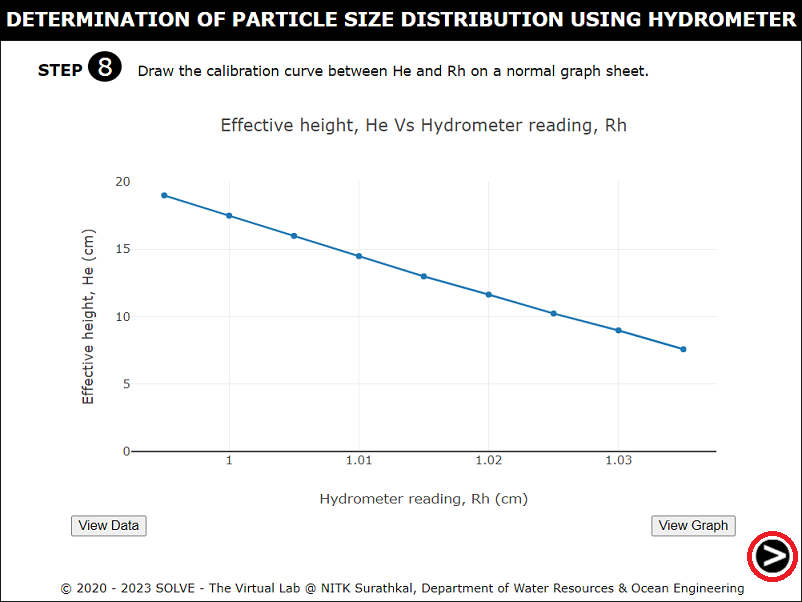

#### The following procedure steps will be followed on the simulator

1. Click on the simulation tab of this experiment. The following window will be displayed. Place the cursor over description, the basic definition of experiment will be displayed.

2. Click on the glass containing water to add water to the 1000 ml measuring jar and water level reading is noted down.

3. Click on the hydrometer and  immerse it  into a measuring jar and note down the increase in water level.

4. Click on the measuring scale to measure the diameter of the measuring jar and calculate the area of the jar. Click on "Check" and "Result" to cross check the answer.

5. Click on the hydrometer and place it on the clean sheet to trace the instruments.

6. Click on the scale to measure the height of the  bulb from the traced image and measure the height between hydrometer and neck.

7. Calculate the effective depth and enter the values. Click on the "Check" and "Result" button to verify the correct answer. Similarly other values are also calculated.

8. Plot the graph for Effective height Vs Hydrometer reading. Click on the next button to proceed further.

9. Weigh 50g of soil passing through 75 micron sieve.

10. Click on the pan to place it on the weighing machine and weigh 50g of soil.

11. Click on the trowel and mix the soil thoroughly.  

12. Click on the pan to transfer the mixture into a blender jar.

13. Click on the switch to On the machine and blend the mixture for 5 mins.

14. Click on the glass containing soil mixture to transfer the mixture into a measuring cylinder.

15.  Click on the glass containing distilled water  to make volume equal to 1000 ml.

16. Click on the container and shake the container.

17. Click on the hydrometer to immerse it into a measuring jar and allow it to float freely.

18. When the hydrometer is immersed into the measuring jar immediately the stop will get started and hydrometer reading for elapsed time will be displayed.

19. Click on the hydrometer and immerse it into distilled water.
  

20. Note down the readings after 24 hours.

21. Calculate the corrected hydrometer reading and enter the values . Click on the "Check" and "Result" to verify the correct answer.

22. From the graph of Effective height Vs Hydrometer corresponding values of He for corrected hydrometer readings are determined.

23. Enter the calculated values. Click on "Check" and "Result" to verify the correct answer. 
 

24. Graph of % finer Vs particle size are displayed.

